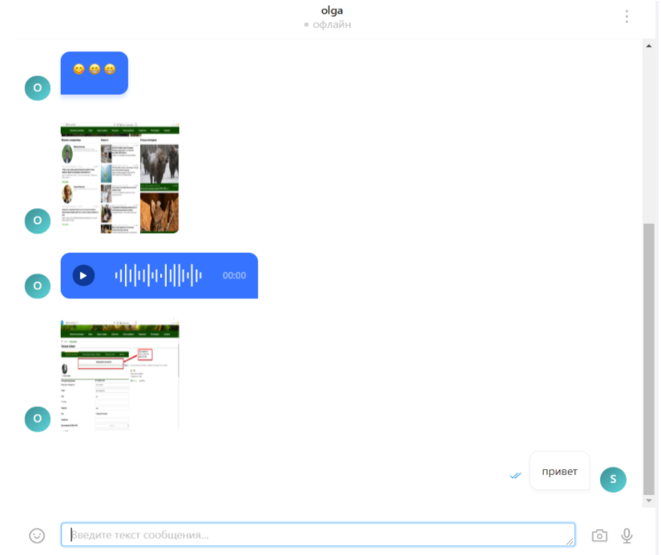

## Messenger

A messenger that allows you to quickly find users and communicate with them online. You can use emojis, photos, voice messages, and you can also edit messages.

 

### Installation

1. ` npm install` or `yarn`
2. Create a `.env` file using the command` cp .env.example .env`
3. Install MongoDB if not already installed and run
4. Execute the command `yarn start` or` npm start`. Execute steps for the "backend-chat" and "react-chat" folders

### Uploading files to Cloudinary

In order for your files to upload successfully, you need to register on the site [cloudinary.com](https://cloudinary.com/).

In the `.env` file, you need to fill in the parameters for the Cloudinary API. To do this, go to [Dashboard](https://cloudinary.com/console) and copy your API parameters.

### Receive confirmation email

To work with mail, we use the `nodemailer` library. You can specify your SMTP server or connect a test server using the mailtrap.io service

1. Register at [mailtrap.io](https://mailtrap.io)
2. Log into your account for this service.
3. In the "Inboxes" list, open "Demo inbox". After that, you will see information about your test SMTP and POP3 server.
4. Open the file `.env` (if not, copy` .env.example` and rename to `.env`)
5. Specify in `NODEMAILER_HOST`, etc. the data that mailtrap.io gave you
6. Restart the backend server.
7. After each registration of an account in the chat, in the section "Demo inbox" (Mailtrap), you will receive confirmation emails.

All technologies used for the back-end: `NodeJS; TypeScript; Express; Mongo; Multer; Nodemailer; Socket.io; JWT; Cloudinary`.
All technologies used for the front-end: `ReactJS; Redux; React Router; Axios; Ant Design; date-fns; Formik`.

